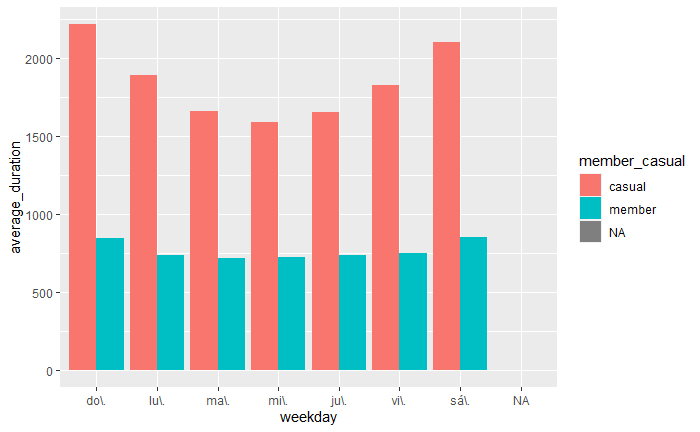
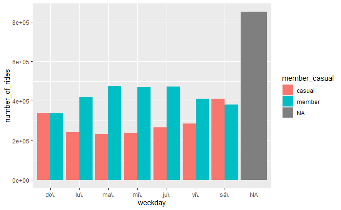

# Cyclistic Bike-Share Data Analysis

## Introduction
Bike-sharing programs have gained significant popularity in recent years due to their potential to offer an affordable, environmentally-friendly, and convenient transportation option for urban commuters. However, with this rapid growth comes the challenge of navigating speedy success and ensuring sustainable growth.

The goal of this project is to maximize the number of annual memberships. The project will identify how casual riders and annual members use Cyclistic bikes differently. After identifying the differences, the project will outline the major findings and recommendations based on the analysis. Each recommendation must be backed up with compelling data insights and professional data visualizations. The final deliverable will recommend the 3 most effective recommendations for growing the number of annual memberships. 

## Problem Statement

Cyclistic’s finance analysts have concluded that annual members are much more profitable than casual riders. Although the
pricing flexibility helps Cyclistic attract more customers, Ms. Lily Moreno (Cyclistic's Director of Marketing) believes that maximizing the number of annual members will
be key to future growth. Rather than creating a marketing campaign that targets all-new customers, Moreno believes there is a
very good chance to convert casual riders into members. She notes that casual riders are already aware of the Cyclistic
program and have chosen Cyclistic for their mobility needs.

Moreno has set a clear goal: Design marketing strategies aimed at converting casual riders into annual members. In order to
do that, however, the marketing analyst team needs to better understand how annual members and casual riders differ, why
casual riders would buy a membership, and how digital media could affect their marketing tactics. Moreno and her team are
interested in analyzing the Cyclistic historical bike trip data to identify trends.

So I will produce a report with the following deliverables:
1. A clear statement of the business task
2. A description of all data sources used
3. Documentation of any cleaning or manipulation of data
4. A summary of the analysis
5. Supporting visualizations and key findings
6. My top three recommendations based on the analysis

## Business Task
Analyze historical trips data from the past 12 months to identify trends and discover connections between the bike usage among annual members and casual riders.

## Skills Demonstrated
The following R features were incorporated:
- Data Wrangling
- Statistical Analysis
- Visualization
- Report Generation

## Data Sourcing
[Source of Data](https://divvy-tripdata.s3.amazonaws.com/index.html)

This is public data that you can use to explore how different customer types are using Cyclistic bikes. 

Note that data-privacy issues prohibit us from using riders’ personally identifiable information. This means that we won’t be able to connect pass purchases to credit card numbers to determine if casual riders live in the Cyclistic service area or if they have purchased multiple single passes.

The data is reliable since it is being provided by Motivate Internation Inc. for this analysis. Also, the given dataset is original and comprehensive.

CSV files with trip data collected from April 01, 2019 to March 31, 2020 provided by Motivate Internation Inc. under this [license](https://ride.divvybikes.com/data-license-agreement).

## Data Transformation/Cleaning:
Data was efficiently cleaned and transformed using the *tydiverse* and *lubridate* packages in R.
Some of the applied steps included:

- Stack individual dataframes into one big data fram
- Remove latitude and longitude related variables
- Add columns that list the date, month, day and year of each ride
- Add a 'ride_length' calculation in seconds and convert from factor to numeric
- Remove data on bikes quality check rides done by HQ

## Modeling
In general, with a single-table design, I was considering the main benefit of the performance improvement by making a single request to retrive all needed items, and better suited to work in R and use descriptive analysis tools to infer insights.

## Analysis and Visualizations

 
## Conclusions & Recommendations
